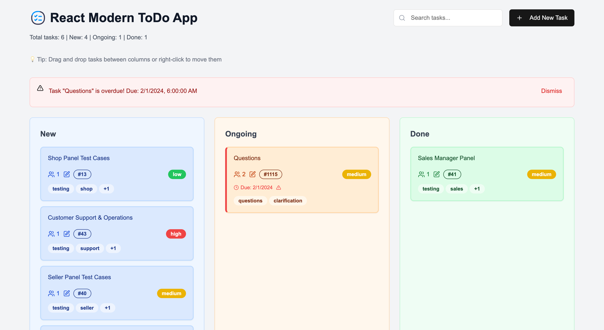
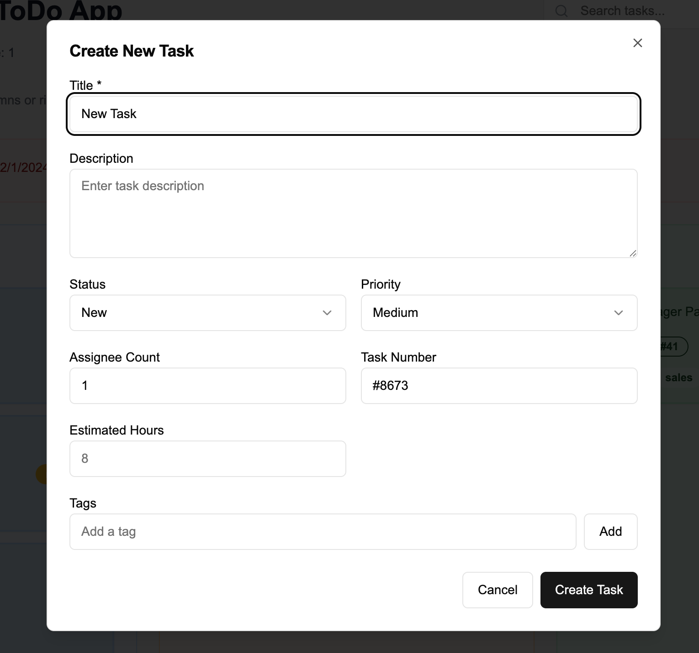
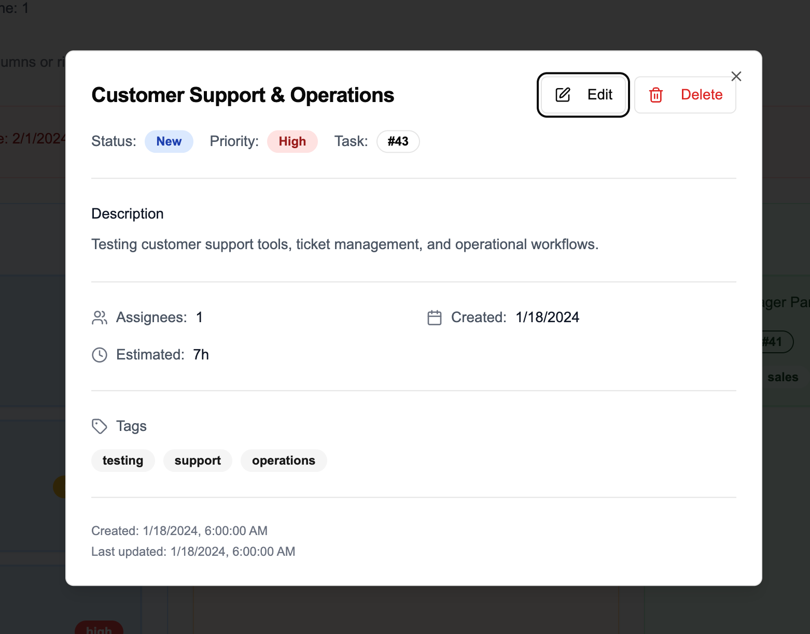
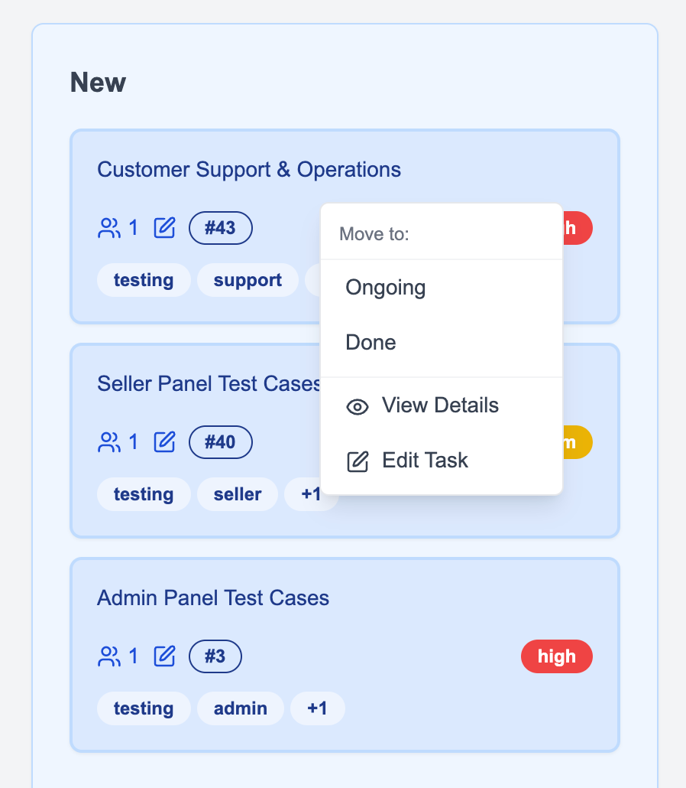
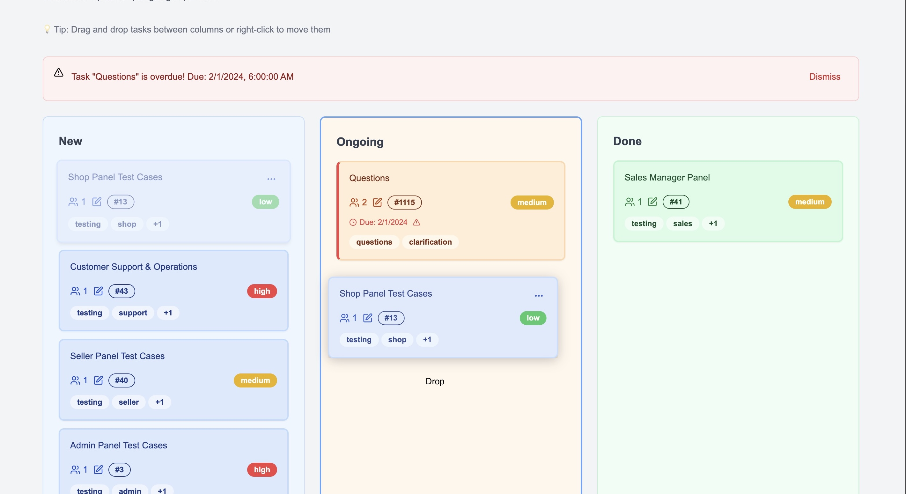
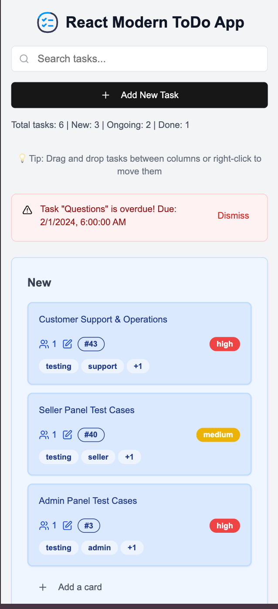
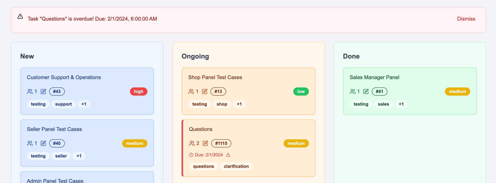

# 🚀 Modern ToDo APP
⚡[Live Site](https://modern-todo-app-five.vercel.app/)

A modern, feature-rich Kanban board todo application built with Next.js, React, TypeScript, and Zustand for state management. This application provides an intuitive drag-and-drop interface for managing tasks across different stages of completion.

## ✨ Features

### 🎯 **Core Functionality**
- **Three-Column Layout**: New, Ongoing, and Done columns
- **Drag & Drop**: Smooth drag-and-drop functionality between columns
- **Right-Click Context Menu**: Quick task movement options
- **Status-Based Theming**: Color-coded cards (Blue for New, Orange for Ongoing, Green for Done)
- **Real-time Updates**: Instant UI updates with optimistic rendering

### 📋 **Task Management**
- **Comprehensive CRUD Operations**: Create, Read, Update, Delete tasks
- **Rich Task Details**: Title, description, priority, assignees, tags, and more
- **Due Date Management**: Set deadlines for ongoing tasks with overdue alerts
- **Task Prioritization**: High, Medium, Low priority levels
- **Tag System**: Flexible tagging for better organization
- **Task Duplication**: Clone existing tasks for similar workflows

### 🎨 **User Experience**
- **Responsive Design**: Mobile-first approach with adaptive layouts
- **Skeleton Loading**: Smooth loading states with skeleton UI
- **Search Functionality**: Real-time search across tasks
- **Overdue Alerts**: Visual indicators and notifications for overdue tasks
- **Smooth Animations**: Polished transitions and hover effects

### 🔧 **Technical Features**
- **Persistent State**: Data persistence using Zustand with localStorage
- **TypeScript**: Full type safety throughout the application
- **Modern UI**: Built with shadcn/ui components and Tailwind CSS
- **Touch Support**: Mobile-friendly drag and drop

## 🛠️ Installation

### Prerequisites
- Node.js 18.0 or later
- npm, yarn, or pnpm

### Quick Start

1. **Clone the repository**
\`\`\`bash
git clone https://github.com/PulokSec/modern-todo-app.git
cd kanban-todo-board
\`\`\`

2. **Install dependencies**
\`\`\`bash
npm install
# or
yarn install
# or
pnpm install
\`\`\`

3. **Run the development server**
\`\`\`bash
npm run dev
# or
yarn dev
# or
pnpm dev
\`\`\`

4. **Open your browser**
Navigate to [http://localhost:3000](http://localhost:3000) to see the application.

### Build for Production

\`\`\`bash
npm run build
npm start
\`\`\`

## 📱 Screenshots

### Main Dashboard

*The main Kanban board with three columns showing different task statuses*

### Task Creation

*Comprehensive task creation form with all available fields*

### Task Details

*Detailed task view showing all task information and metadata*

### Right-Click Context Menu

*Right-click context menu for quick task actions*

### Drag and Drop

*Smooth drag and drop functionality between columns*

### Mobile View

*Responsive design optimized for mobile devices*

### Overdue Alerts

*Visual alerts for overdue tasks with dismissible notifications*

## 🎮 Usage Guide

### Creating Tasks

1. **Quick Creation**: Click the "Add New Task" button in the header
2. **Column-Specific**: Click "Add a card" in any column to create tasks in that status
3. **Context Menu**: Use the three-dot menu in column headers

### Moving Tasks

1. **Drag & Drop**: Click and drag tasks between columns
2. **Right-Click Menu**: Right-click any task to see movement options
3. **Dropdown Menu**: Use the three-dot menu on task cards

### Managing Due Dates

1. **Setting Deadlines**: When moving tasks to "Ongoing", set a due date
2. **Overdue Handling**: Tasks automatically show overdue status when past due date
3. **Date Updates**: Editing due dates to future dates clears overdue status

### Task Organization

1. **Priority Levels**: Set High, Medium, or Low priority with color coding
2. **Tags**: Add multiple tags for categorization and filtering
3. **Search**: Use the search bar to find tasks by title, description, or tags
4. **Assignees**: Track team member assignments with assignee counts

## 🏗️ Project Structure

\`\`\`
modern-todo-app/
├── app/                    # Next.js app directory
│   ├── page.tsx           # Main application page
│   ├── layout.tsx         # Root layout
│   └── globals.css        # Global styles
├── components/            # React components
│   ├── ui/               # shadcn/ui components
│   ├── task-card.tsx     # Task card component
│   ├── task-form.tsx     # Task creation/editing form
│   ├── task-details.tsx  # Task details modal
│   └── *-skeleton.tsx    # Loading skeleton components
├── lib/                  # Utility libraries
│   ├── store.ts          # Zustand state management
│   └── utils.ts          # Utility functions
├── public/               # Static assets
    └── screenshots/          # Application screenshots
\`\`\`

### Customization

#### Colors
Modify task status colors in \`components/task-card.tsx\`:

\`\`\`typescript
const getStatusColors = (status: TaskStatus) => {
  switch (status) {
    case "new":
      return { background: "bg-blue-100", text: "text-blue-900" }
    case "ongoing":
      return { background: "bg-orange-100", text: "text-orange-900" }
    case "done":
      return { background: "bg-green-100", text: "text-green-900" }
  }
}
\`\`\`

#### Task Fields
Add custom fields by extending the \`Task\` interface in \`lib/store.ts\`.

## 🧪 Testing

### Manual Testing Checklist

- [ ] Create new tasks in each column
- [ ] Drag and drop tasks between columns
- [ ] Right-click context menu functionality
- [ ] Due date setting and overdue detection
- [ ] Search functionality
- [ ] Mobile responsiveness
- [ ] Data persistence after page reload

### Browser Compatibility

- ✅ Chrome 90+
- ✅ Firefox 88+
- ✅ Safari 14+
- ✅ Edge 90+

### Development Guidelines

- Follow TypeScript best practices
- Use meaningful commit messages
- Add proper error handling
- Maintain responsive design
- Test on multiple devices

## 📦 Dependencies

### Core Dependencies
- **Next.js 15**: React framework for production
- **React 19**: UI library
- **TypeScript**: Type safety
- **Zustand**: State management
- **Tailwind CSS**: Utility-first CSS framework

### UI Components
- **shadcn/ui**: Modern UI component library
- **Lucide React**: Icon library
- **react-dnd**: Drag and drop functionality

### Development Dependencies
- **ESLint**: Code linting
- **Prettier**: Code formatting
- **TypeScript**: Type checking

## 🐛 Troubleshooting

### Common Issues

**Issue**: Tasks not persisting after page reload
**Solution**: Check browser localStorage permissions and clear cache

**Issue**: Drag and drop not working on mobile
**Solution**: Ensure touch events are enabled and try refreshing the page

**Issue**: Overdue alerts not showing
**Solution**: Check system time and task due dates are set correctly

### Performance Tips

- Clear completed tasks regularly
- Limit the number of tags per task
- Use search to find specific tasks in large lists

## 🙏 Acknowledgments

- [shadcn/ui](https://ui.shadcn.com/) for the beautiful UI components
- [Lucide](https://lucide.dev/) for the icon library
- [Zustand](https://github.com/pmndrs/zustand) for state management
- [react-dnd](https://react-dnd.github.io/react-dnd/) for drag and drop functionality

**Made with ❤️ By Pulok Chowdhury**
